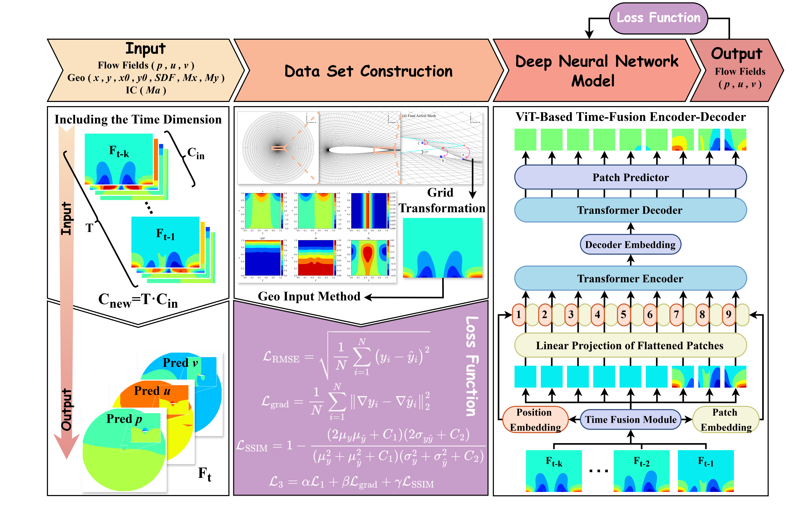

<<<<<<< HEAD
# ViT-STFlowNet
=======
<<<<<<< HEAD
# ViT-STFlowNet
=======
<<<<<<< HEAD
# ViT-STFlowNet
=======
<<<<<<< HEAD
# ViT-STFlowNet
=======
# ViT-STFlowNet: Geometry-Adaptive Spatiotemporal Flow Prediction Framework



## 📌 Core Innovation
**ViT-STFlowNet** is a novel Vision Transformer-based architecture for predicting **non-periodic unsteady flows in deformable domains**, featuring:
- **Geometry-adaptive attention**: Dynamically adjusts to domain deformations via SDF-enhanced positional encoding
- **Spatiotemporal coherence**: Hybrid CNN-Transformer structure captures multiscale flow features
- **Physics-aware training**: Combined RMSE/Gradient/SSIM loss enforces physical consistency

## 🚀 Quick Start
### Prerequisites
```bash
conda create -n vitst python=3.9
conda install pytorch==2.0.1 torchvision==0.15.2 -c pytorch
pip install einops torchinfo matplotlib
```

## 🚀 Testing (Example)
Test mach number can be 0.31, 0.4, 0.54, 0.63
```bash
python test.py \
  --test_ma 0.31
python contour.py \
  --test_ma 0.31
```

>>>>>>> 7340a44 (first commit)
