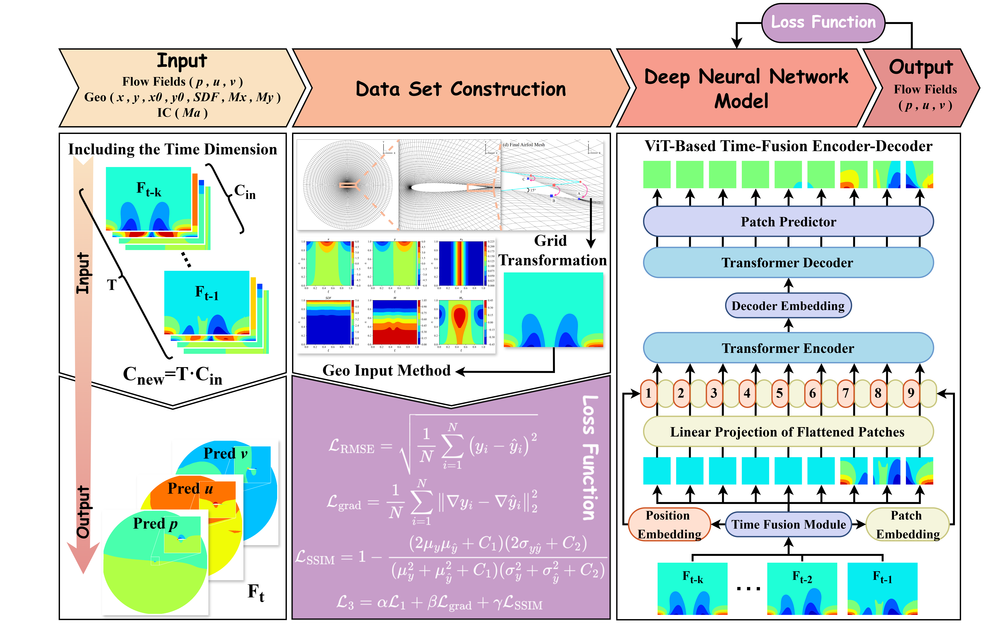

# ViT-STFlowNet: Geometry-Adaptive Spatiotemporal Flow Prediction Framework



## 📌 Core Innovation
**ViT-STFlowNet** is a novel Vision Transformer-based architecture for predicting **non-periodic unsteady flows in deformable domains**, featuring:
- **Geometry-adaptive attention**: Dynamically adjusts to domain deformations via SDF-enhanced positional encoding
- **Spatiotemporal coherence**: Hybrid CNN-Transformer structure captures multiscale flow features
- **Physics-aware training**: Combined RMSE/Gradient/SSIM loss enforces physical consistency

## 🚀 Quick Start
### Prerequisites
```bash
conda create -n vitst python=3.9
conda install pytorch==2.0.1 torchvision==0.15.2 -c pytorch
pip install einops torchinfo matplotlib

## 🚀 Training (Example)
```bash
python train.py \
  --method_type 2 \
  --loss_num 3 \
  --encoder_depth 4 \
  --batch_size 64
